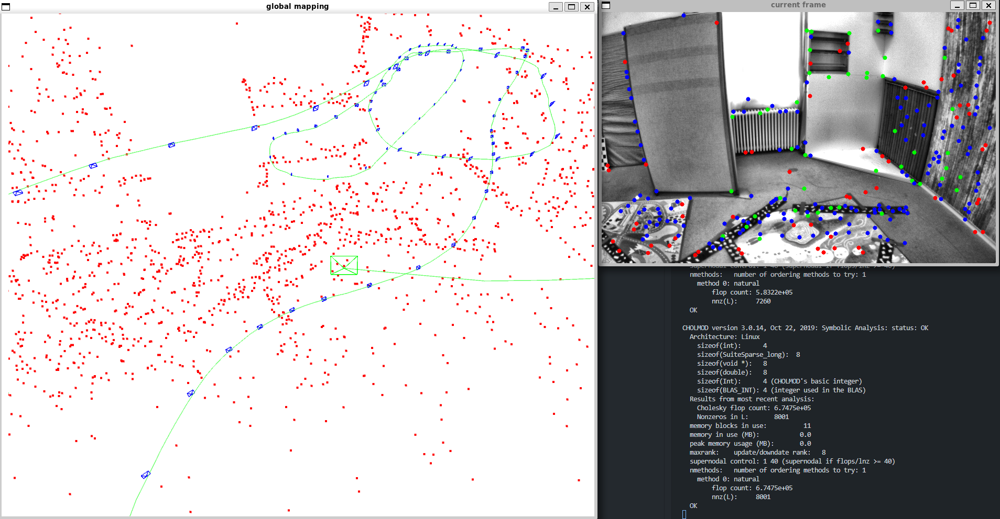

# OV²SLAM Linux_Universal

Linux universal version of OV²SLAM, using Pangolin to visualize the results.

Refer to original repo for details: [OV²SLAM](https://github.com/ov2slam/ov2slam)

### Modify
- Use `Pangolin` to visualize simply, inspired by [ORB-SLAM2](https://github.com/raulmur/ORB_SLAM2)
- Delete original ros_based functions
- Fix bugs for `multiple definitions` of static variables in `logger.hpp`
- Simplify `CMakeLists.txt`, but should make some settings manually

### Example
Add an example for euroc_mono dataset. Worked in accurate mode on Ubuntu-20.04.

**Run Command:**
```
cd example

./mono_euroc ../parameters_files/acurrate/euroc/euroc_mono.yaml ${path_to_euroc_dataset}/mav0/cam0/data euroc_ts/${matched_timestamps_file}
```

**Preview:**


